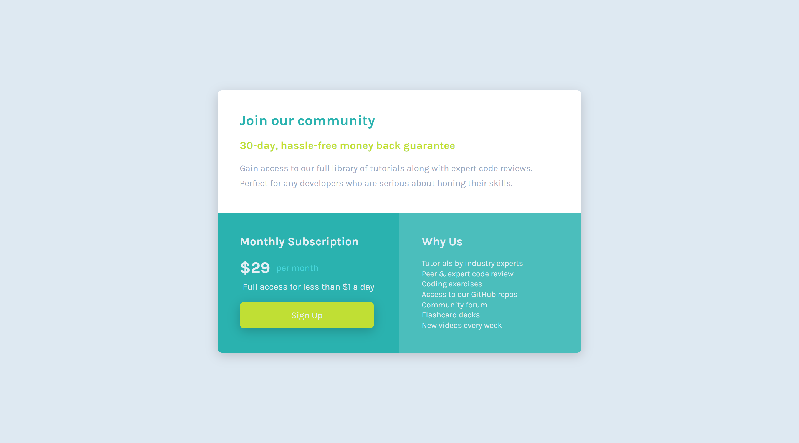

# Frontend Mentor - Single price grid component solution

This is a solution to the [Single price grid component challenge on Frontend Mentor](https://www.frontendmentor.io/challenges/single-price-grid-component-5ce41129d0ff452fec5abbbc). Frontend Mentor challenges help you improve your coding skills by building realistic projects. 

## Table of contents

- [Overview](#overview)
  - [The challenge](#the-challenge)
  - [Screenshot](#screenshot)
  - [Links](#links)
- [My process](#my-process)
  - [Built with](#built-with)
  - [What I learned](#what-i-learned)
  - [Continued development](#continued-development)
  - [Useful resources](#useful-resources)
- [Author](#author)


## Overview

### The challenge

Users should be able to:

- View the optimal layout for the component depending on their device's screen size
- See a hover state on desktop for the Sign Up call-to-action

### Screenshot



### Links

- Solution URL: [https://github.com/Makson19/single-price-grid-component-master](https://github.com/Makson19/single-price-grid-component-master)
- Live Site URL: [https://makson19.github.io/single-price-grid-component-master/](https://makson19.github.io/single-price-grid-component-master/)

## My process

### Built with

- Semantic HTML5 markup
- CSS custom properties
- SASS
- Flexbox
- CSS Grid
- Mobile-first workflow


### What I learned


In this project I learned to use the Grid Layout and some of its properties. Below is a snippet of the CSS code I used:

```css
.container {
    display: grid;
    grid-template-rows: 0.9fr 1.1fr;
    grid-template-columns: 1fr 1fr;
    grid-template-areas: "w1 w1"
                          "w2 w3";
}
```

### Continued development

I will continue to practice CSS grid and SASS.

### Useful resources

- [Desvendando o CSS Grid na prática](https://www.youtube.com/watch?v=HN1UjzRSdBk&t=1229s&ab_channel=Rocketseat) - This video helped me understand the Grid Layout concept as well as its properties.

## Author

- Frontend Mentor - [@Makson19](https://www.frontendmentor.io/profile/Makson19)
- Github - [Makson19](https://github.com/Makson19)
- Codepen - [@Makson19](https://codepen.io/Makson19)
